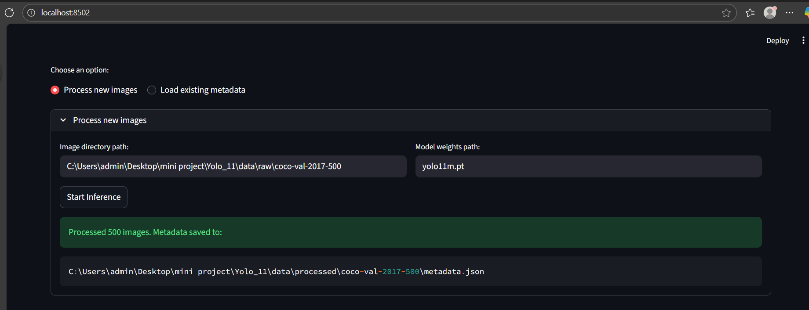
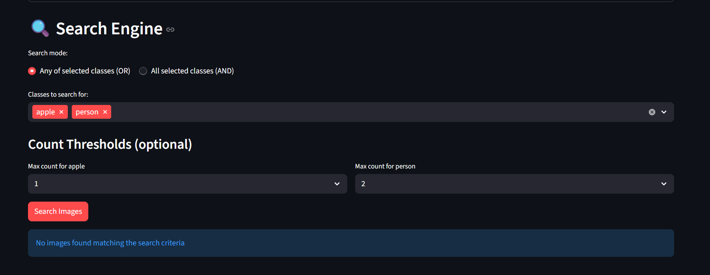
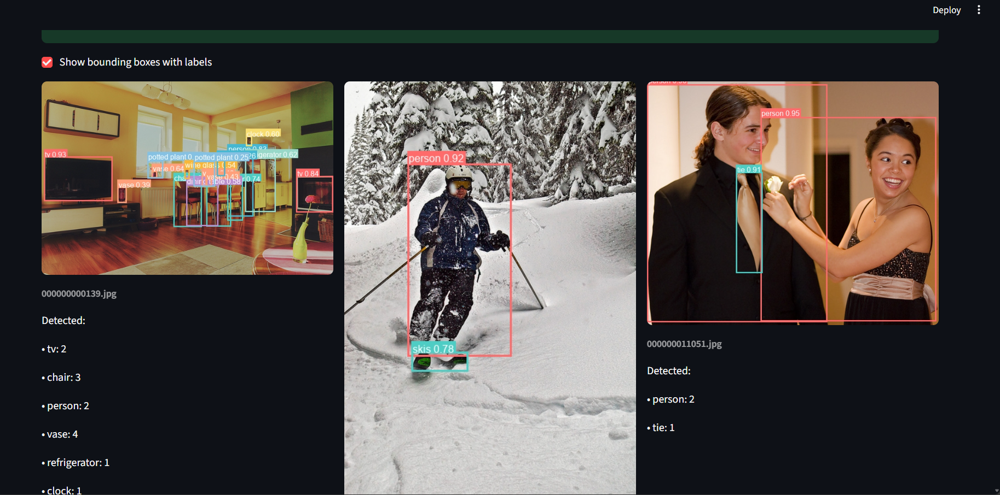

# YOLOv11 Computer Vision Powered Search Application

A Streamlit-based web application that enables intelligent image search using YOLOv11 object detection. Search through your image collections by specifying objects, classes, and count thresholds.

## Features

  **Smart Image Search** - Find images containing specific objects
  **Object Detection** - Powered by YOLOv11 for accurate detection
  **Bounding Box Visualization** - See detected objects with labeled boxes
  **Metadata Management** - Save and load detection results
  **Visual Results** - Grid display of matching images
  **Flexible Filtering** - Search with AND/OR logic and count thresholds
  **Persistent Storage** - Reuse previously processed metadata

## Project Structure

```
Yolo_11/
├── app.py                          # Main Streamlit application
├── configs/
│   └── default.yaml                # Model configuration
├── src/
│   ├── __init__.py
│   ├── config.py                   # Configuration loader
│   ├── inference.py                # YOLOv11 inference engine
│   └── utils.py                    # Utility functions
├── data/
│   ├── raw/                        # Input images
│   └── processed/                  # Generated metadata
└── test/
    └── streamlit_basics.py         # Streamlit examples
```

## Installation

### Prerequisites

- Python 3.8+
- CUDA-compatible GPU (recommended)
- Anaconda/Miniconda (optional)

### Setup

1. **Clone or download the project**

2. **Install dependencies**

```bash
pip install streamlit ultralytics pillow pyyaml
```

3. **Download YOLO model weights** (optional - auto-downloads on first run)

```bash
# The app uses yolo11m.pt by default
# It will auto-download if not present
```

## Usage

### Starting the Application

```bash
streamlit run app.py
```

The application will open in your browser at `http://localhost:8501`

### Workflow

#### Option 1: Process New Images

1. **Select "Process new images"**
2. **Enter paths:**
   - Image directory: `C:\Users\admin\Desktop\mini project\Yolo_11\data\raw\coco-val-2017-500`
   - Model weights: `yolo11m.pt` (default)
3. **Click "Start Inference"**

**Sample Input:**
```
Image directory: data/raw/coco-val-2017-500
Model weights: yolo11m.pt
```

**Sample Output:**
```
 Processed 500 images. Metadata saved to:
data/processed/coco-val-2017-500/metadata.json
```

#### Option 2: Load Existing Metadata

1. **Select "Load existing metadata"**
2. **Enter metadata path:**
   - `C:\Users\admin\Desktop\mini project\Yolo_11\data\processed\coco-val-2017-500\metadata.json`
3. **Click "Load Metadata"**

**Sample Input:**
```
Metadata file path: data/processed/coco-val-2017-500/metadata.json
```

**Sample Output:**
```
Successfully loaded metadata for 500 images.
```

### Search Examples

#### Example 1: Simple Search (OR Logic)

**Input:**
- Search mode: `Any of selected classes (OR)`
- Classes: `apple`, `person`
- Thresholds: `None`, `None`

**Result:** Returns all images containing either apples OR persons (or both)

```
Found 150 images
```

#### Example 2: Exact Count Search

**Input:**
- Search mode: `Any of selected classes (OR)`
- Classes: `person`
- Max count for person: `1`

**Result:** Returns images with exactly 1 person

```
Found 45 images
```

#### Example 3: Combined Search (AND Logic)

**Input:**
- Search mode: `All selected classes (AND)`
- Classes: `person`, `car`
- Max count for person: `2`
- Max count for car: `None`

**Result:** Returns images containing BOTH persons (max 2) AND cars (any count)

```
Found 23 images
```

## Configuration

Edit `configs/default.yaml` to customize:

```yaml
model:
  conf_threshold: 0.25    # Detection confidence threshold (0-1)

data:
  image_extension:        # Supported image formats
    - .jpg
    - .jpeg
    - .png
```

## Metadata Format

Generated `metadata.json` structure:

```json
[
  {
    "image_path": "C:/path/to/image.jpg",
    "detections": [
      {
        "class": "person",
        "confidence": 0.8548,
        "bbox": [111.91, 296.87, 353.71, ...],
        "count": 1
      }
    ],
    "total_objects": 3,
    "unique_class": ["person", "car"],
    "class_counts": {
      "person": 1,
      "car": 2
    }
  }
]
```

## Sample Outputs

> **Note:** To add screenshots to this documentation, capture images of the application interface and save them in `docs/images/` directory. See `docs/images/README.md` for detailed instructions.

### Application Interface

#### Main Screen


*The main application interface showing the two options: Process new images or Load existing metadata*

#### Processing Images


*Object detection in progress on a batch of images*

#### Search Interface


*Search configuration with class selection and count thresholds*

#### Search Results


*Grid display of images matching the search criteria with detected objects*

### Search Results Display

When you search for images, the app displays:

1. **Success message**: `Found 100 matching images`
2. **Bounding Box Toggle**: Checkbox to show/hide bounding boxes
3. **Image grid**: 3 columns showing:
   - Image preview with bounding boxes (if enabled)
   - Color-coded boxes around detected objects
   - Labels with class name and confidence score
   - Filename
   - Detected objects with counts

#### Bounding Box Features:
- **Color-coded**: Each object class gets a unique color from a 10-color palette
- **Labels**: Shows class name and confidence score (e.g., "person 0.85")
- **Toggle**: Enable/disable visualization with the checkbox
- **Multi-object**: Displays all detected objects with individual boxes
- **Automatic**: Boxes are drawn automatically when search results are displayed
- **Confidence threshold**: Only objects above the configured threshold are shown

Example display:
```
[Image 1]                [Image 2]                [Image 3]
[Red box: person 0.85]   [Red box: person 0.92]   [Blue box: apple 0.78]
[Green box: car 0.76]    [Orange: bicycle 0.81]   [Red box: person 0.84]
000000056381.jpg         000000123456.jpg         000000789012.jpg

Detected:                Detected:                Detected:
• person: 1              • person: 2              • apple: 5
• car: 2                 • bicycle: 1             • person: 1
```

## Search Logic

### OR Mode (Any of selected classes)
- Returns images containing **at least one** of the selected classes
- Example: Search for `apple` OR `banana` → returns images with either or both

### AND Mode (All selected classes)
- Returns images containing **all** selected classes
- Example: Search for `person` AND `car` → returns only images with both

### Count Thresholds
- `None`: Any count (≥1)
- `1`: Exactly 1 object
- `2`: 1 or 2 objects
- `5`: 1 to 5 objects

## Troubleshooting

### Issue: ModuleNotFoundError

**Solution:** Ensure all dependencies are installed:
```bash
pip install streamlit ultralytics pillow pyyaml
```

### Issue: CUDA out of memory

**Solution:** Use CPU mode by modifying `src/inference.py`:
```python
device='cpu'  # Change from 'cuda'
```

### Issue: Image not displaying

**Solution:** Verify image paths are absolute and files exist at the specified locations

## Performance Tips

1. **Use GPU**: Significantly faster than CPU for inference
2. **Batch processing**: Process images in batches for large datasets
3. **Cache metadata**: Load existing metadata instead of re-processing
4. **Adjust threshold**: Higher `conf_threshold` = fewer detections but higher accuracy

## Supported Object Classes

YOLOv11 detects 80 COCO classes including:
- People: `person`
- Vehicles: `car`, `truck`, `bus`, `bicycle`, `motorcycle`
- Animals: `dog`, `cat`, `horse`, `elephant`, `bear`
- Food: `apple`, `banana`, `sandwich`, `pizza`, `donut`
- Electronics: `laptop`, `cell phone`, `tv`, `keyboard`
- And 60+ more...

## License

This project uses:
- **YOLOv11** by Ultralytics (AGPL-3.0)
- **Streamlit** (Apache 2.0)

## Credits

- YOLOv11: [Ultralytics](https://github.com/ultralytics/ultralytics)
- UI Framework: [Streamlit](https://streamlit.io/)
- Dataset: COCO validation set

## Contact & Support

For issues or questions:
1. Check the troubleshooting section
2. Review configuration files
3. Verify image paths and formats
